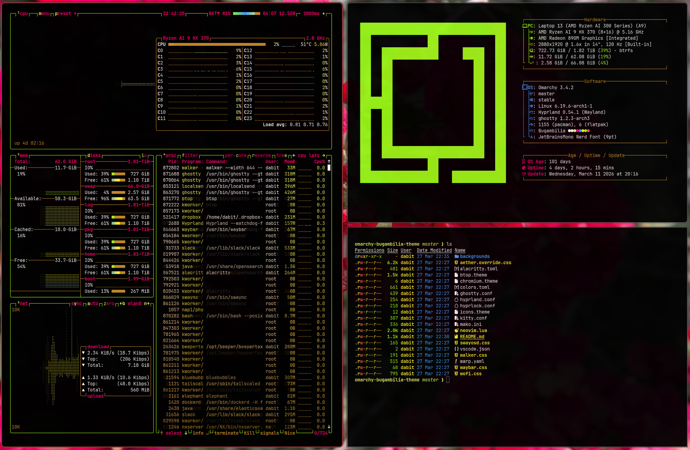
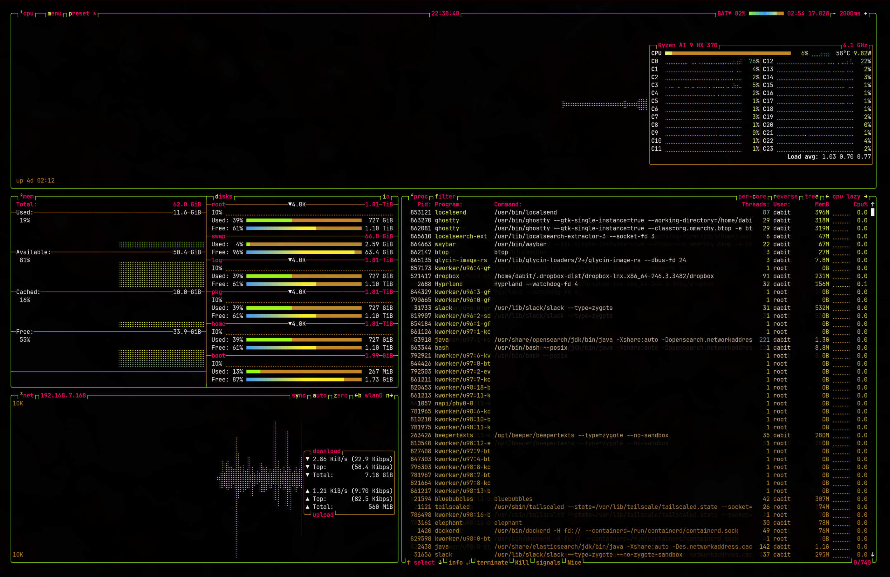
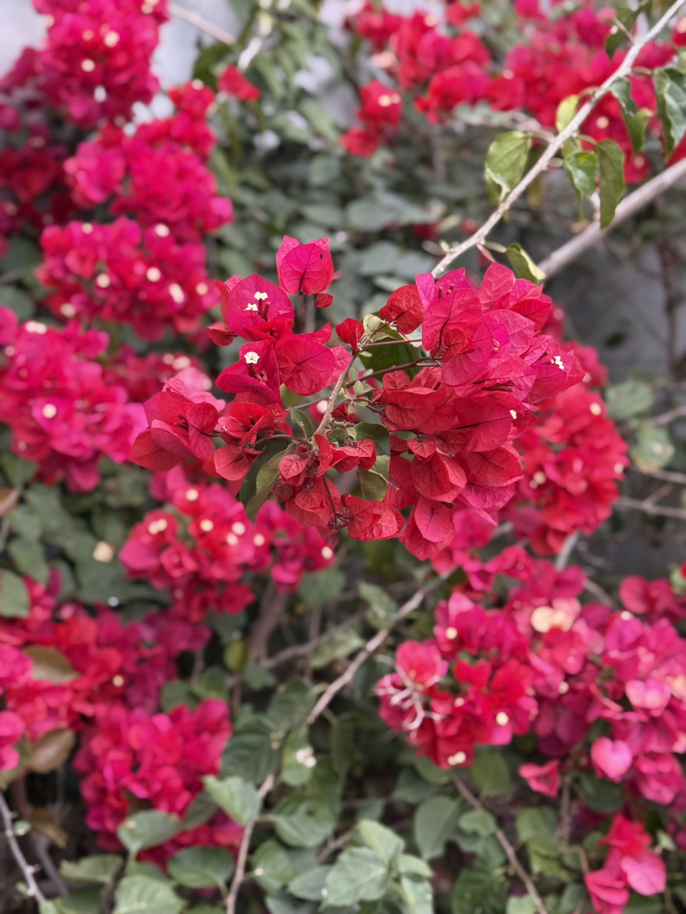
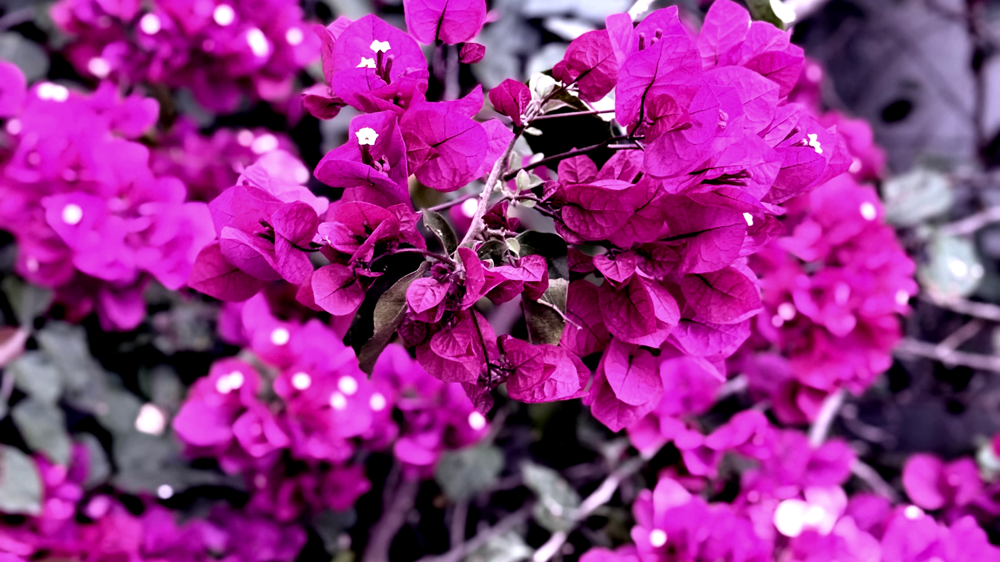

# Bugambilia

A dark theme for [Omarchy](https://omarchy.com) inspired by the vivid magentas and greens of bougainvillea flowers against a night sky.

## Screenshots

## Backgrounds

## Color Palette

| Color          | Normal    | Bright    |
|----------------|-----------|-----------|
| Black          | `#000000` | `#c3892a` |
| Red            | `#ff525b` | `#ff5263` |
| Green          | `#9dff16` | `#cfff8e` |
| Yellow         | `#fff42b` | `#fffaa3` |
| Blue           | `#3f9fff` | `#b5dbff` |
| Magenta        | `#f5006b` | `#ff529d` |
| Cyan           | `#f2ff67` | `#fcffde` |
| White          | `#fefafc` | `#fefafa` |

- **Background:** `#000000`
- **Foreground:** `#fefafa`
- **Accent:** `#3f9fff`

## Supported Applications

- **Terminals:** Alacritty, Ghostty, Kitty, Warp
- **Editor:** Neovim (via [aether.nvim](https://github.com/bjarneo/aether.nvim)), VS Code
- **Desktop:** Hyprland, Hyprlock, Waybar, Mako, SwayOSD, Walker, Wofi
- **GTK:** Aether override (full Adwaita color overrides)
- **Browser:** Chromium
- **System monitor:** btop
- **Icons:** Yaru-magenta
